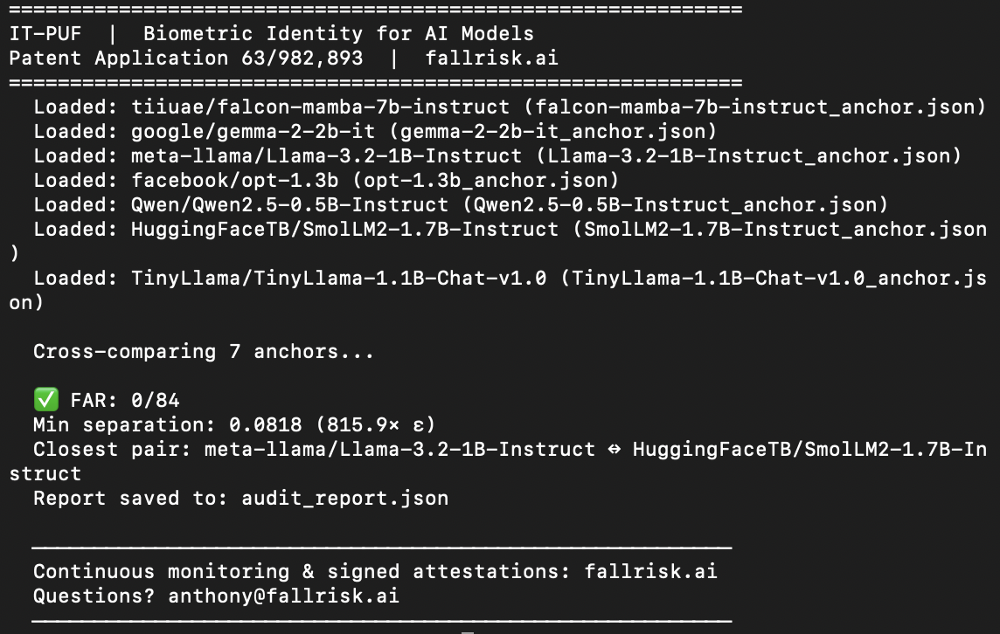
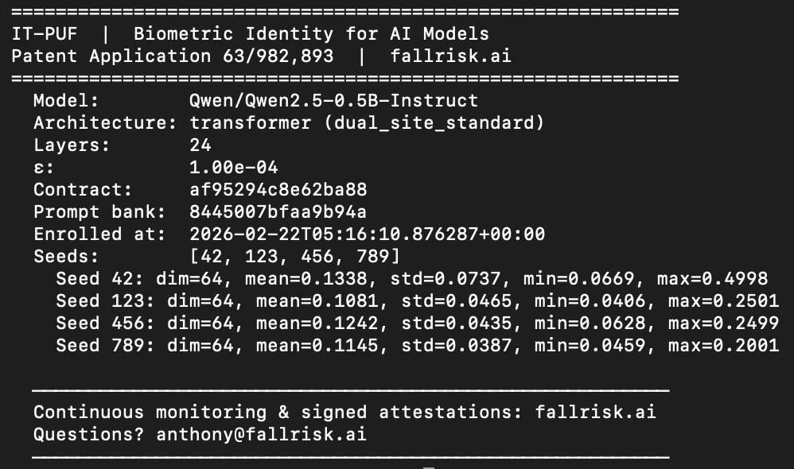

# IT-PUF: Biometric Identity Verification for AI Models

[](LICENSE)
[](https://fallrisk.ai)
[](https://fallrisk.ai)
[](https://pypi.org/project/fallrisk-itpuf/)

**Know which model is running. Prove it to your auditor.**

IT-PUF (Inference-Time Physical Unclonable Function) is a challenge-response fingerprinting system that creates a unique, unforgeable identity for every neural network — and detects any swap, distillation, or fine-tuning in seconds.

### 7 models. 0 false accepts. 815× minimum separation.





## The Problem

Your AI agent has database access, sends emails, and makes decisions 24/7. Container hashes tell you what *file* is deployed — not what *intelligence* is running. If someone swaps the weights, your existing tools won't notice.

## The Solution

```bash
pip install fallrisk-itpuf

# Inspect an enrolled model's identity
itpuf info --anchor Qwen2.5-0.5B-Instruct_anchor.json

# Cross-compare anchors — see the separation for yourself
itpuf audit --anchors *.json
# → ✅ FAR: 0/84 | Min separation: 0.0818 (815.9× ε)
```

Different model? 815× above the acceptance threshold. Same model? Bit-identical. No ambiguity.

## How It Works

IT-PUF measures a structural invariant in how each model's probability mass competes at the output layer — a fingerprint that is unique to each model's architecture and training history. The measurement is:

- **Deterministic** — same model + same prompt → same fingerprint, bit-for-bit
- **Architecture-invariant** — works on Transformers, Mamba, parallel architectures
- **Unforgeable** — proven impossible to spoof without reproducing the model (311+ Coq theorems, 0 Admitted)
- **Quantization-robust** — survives NF4/INT8 compression

Validated across 23 models, 16 families, 3 architecture types. **0 false accepts in 1,012 pairwise comparisons.** Minimum separation: 485× the acceptance threshold.

## Installation

```bash
pip install fallrisk-itpuf
```

Requires Python ≥ 3.9. The open-source package includes anchor management, cross-comparison, and the verification math. All operations work with numpy only — no GPU required.

## What's Included

| Command | What It Does | Requires |
|---------|-------------|----------|
| `itpuf info` | Inspect an enrolled anchor | Open source ✅ |
| `itpuf audit` | Cross-compare anchors, compute FAR | Open source ✅ |
| `itpuf enroll` | Measure a model's identity | Measurement engine |
| `itpuf verify` | Check a live model against an anchor | Measurement engine |

The **measurement engine** (model enrollment and live verification) is available through a commercial license from Fall Risk AI. This is the same split used by TLS certificate authorities: anyone can *verify* a certificate; you *obtain* one from a trusted provider.

## Quick Start with Demo Anchors

<<<<<<< HEAD
Download pre-enrolled demo anchors from [GitHub Releases](https://github.com/fallrisk-ai/IT-PUF/releases) and explore:
=======
Download pre-enrolled demo anchors from [GitHub Releases](https://github.com/fallrisk-ai/IT-PUF/releases/tag/v0.1.0) and explore:
>>>>>>> f20002b209e61e2bfe351b8b3f31f430c34ab4e1

```bash
# See what an enrolled identity looks like
itpuf info --anchor Qwen2.5-0.5B-Instruct_anchor.json

# Compare all demo models — observe the separation
itpuf audit --anchors *.json
```

**Demo zoo (v0.1.0):** 7 models, 5 families, 2 architecture types (Transformer + Mamba SSM)

| Model | Family | Architecture |
|-------|--------|-------------|
| Qwen2.5-0.5B-Instruct | Qwen | Transformer |
| SmolLM2-1.7B-Instruct | SmolLM | Transformer |
| TinyLlama-1.1B-Chat-v1.0 | Llama | Transformer |
| Llama-3.2-1B-Instruct | Llama | Transformer |
| Gemma-2-2B-it | Google | Transformer |
| OPT-1.3B | OPT | Transformer |
| Falcon-Mamba-7B-Instruct | TII | **Mamba SSM** |

## Python API

```python
import itpuf

# Load enrolled anchors
anchor_a = itpuf.Anchor.load("model_a_anchor.json")
anchor_b = itpuf.Anchor.load("model_b_anchor.json")

# Compare: are these the same model?
result = anchor_a.verify_against(anchor_b)
print(result.decision)      # "ACCEPT" or "REJECT"
print(result.max_distance)  # L2 distance
print(result.accepted)      # bool

# Cross-compare a full zoo
report = itpuf.compute_far([anchor_a, anchor_b, anchor_c])
print(f"FAR: {report['n_false_accepts']}/{report['n_pairs']}")
```

## Security Properties

| Property | Guarantee | Evidence |
|----------|-----------|----------|
| Uniqueness | Every model produces a distinct fingerprint | 0/1,012 FAR across 23 models |
| Determinism | Same inputs → identical measurement | Bit-exact on same hardware |
| Unforgeability | Cannot produce a model with a target fingerprint | Coq impossibility proof (NoSpoofing.v) |
| Robustness | Survives quantization (NF4, INT8) | Tested, distances remain > 400× ε |
| Sensitivity | Detects LoRA fine-tuning, weight swaps | Closest attack: 10.7× ε (still REJECT) |

## Who This Is For

- **Compliance teams** preparing for EU AI Act high-risk conformity (August 2026)
- **CISOs** who need to prove which model powers their AI agents
- **MLOps teams** who want model identity in their CI/CD pipeline
- **Auditors** who need cryptographic evidence, not container hashes

## Science

The full theory, proofs, and validation are published:

- **Paper:** "The δ-Gene: Inference-Time Physical Unclonable Functions from Architecture-Invariant Output Geometry"
- **Formal verification:** 311+ Coq theorems, 0 Admitted
- **Patent:** Application 63/982,893 (February 13, 2026)

## License & Commercial Use

**Free for evaluation and research.**
Anyone can `pip install`, inspect anchors, cross-compare models, and explore the verification math at no cost.

**Commercial / production use** (enrollment, live verification, continuous monitoring, signed attestations, fleet management, and enterprise support) requires a commercial license from Fall Risk Research.

Contact [anthony@fallrisk.ai](mailto:anthony@fallrisk.ai) for pricing, licensing, and pilot programs.

---

**Fall Risk Research** | [fallrisk.ai](https://fallrisk.ai) | Patent Application 63/982,893

*Identity is not emergent. It is structural.*
